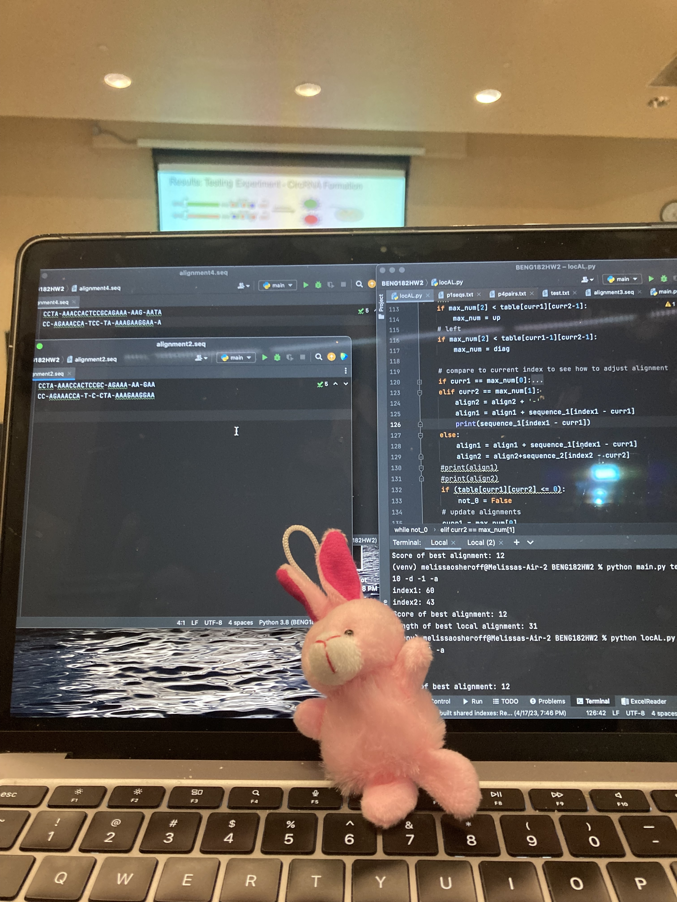

# Melissa Osheroff
## Introduction
> Nice to meet you! I am currently a *fourth year* at **UCSD** and I am studying Bioengineering with a concentration in Bioinformatics. This is a website to demonstrate core markdown constructs like ~~strikethrough~~, **bold and *nested* italic**, subscript<sub>sub</sub>, and supscript<sup>sup</sup>. </br>

\- *M.O.*

### (Re)Intro: Gallery
- <picture>
  
</picture>

- <picture>
 
</picture>

## Bucket List
- [ ] Graduate College
- [ ] Read Harry Potter Series
- [x] See a manatee

## Experience 
1. [***Here***](https://drive.google.com/file/d/1C4S_4A7KjHSumRafDZuZHzzaKnhjhFov/view?usp=drive_link) is my resume.
2. Or you can just take my word for it.
## Hobbies

## Example Psuedo Code
```
function hasCode(assignment) bool
    includedCode = False
    if example of code is in assignment
        includedCode = True
    return includedCode
```
## Relative Link
[Click here to see one of my screenshots from part 2](screenshots/Screenshot 2024-04-04 at 7.45.33 PM.png)
